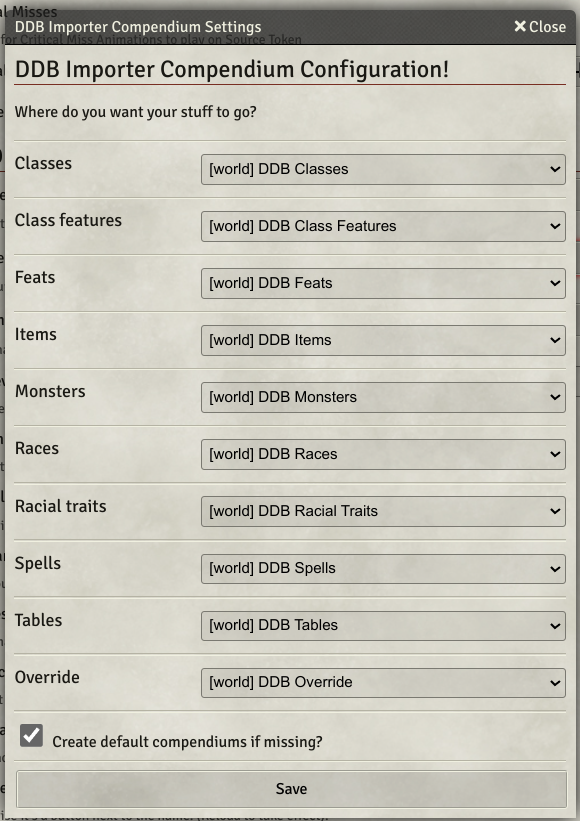
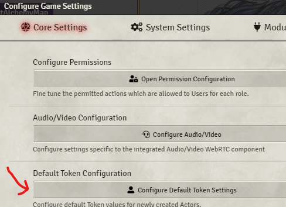

# FAQ

## I have some questions about 2024 D&D or version 4.x D&D 5e System

See the [2024 FAQ](./FAQ-2024-DND.md).

# Is there a guide covering the features?

For a overview video see: https://youtu.be/OMaJHLQORWo

## The import buttons are greyed out!

They require the cobalt token setting to be set.

## There are no map backgrounds after importing an adventure

Make sure you are using the most up to date version of Adventure Muncher.

## How do I get the Cobalt key manually?

Open up a page of DnDbeyond and be sure you're logged in.
Hit F12 or CTRL + Shift + I > Application > Cookies > dndbeyond.com > Search for Cobalt > Copy the key from the Value Field

## My Core settings screen won't open

Open the Browser Developer Console (F12) and run the following:

```javascript
game.modules.get("ddb-importer").api.resetSecrets();
```

## My Muncher window never appears

I just get a UI message `Checking your DDB details - this might take a few seconds!`.

Open the Browser Developer Console (F12) and run the following:

```javascript
game.modules.get("ddb-importer").api.resetSecrets();
```

## Whenever I use the "Fetch My Campaigns" button it hangs and nothing happens

If you know what the campaign ID (it's a number, you can find it in the URL of your campaign on DDB) you can manually set it by opening the Browser Developer Console (F12) and run the following:

```javascript
game.settings.set("ddb-importer", "campaign-id", "ID_HERE")
```

## I purchased content on DDB and it's not available!

Sometimes you just need to wait a little bit. Sometimes you need to [Sync your entitlements](https://dndbeyond-support.wizards.com/hc/en-us/articles/7747224765588-Sync-Entitlements).

For characters/spells/items check that you can create a character on DDB with those features. For adventures, make sure you can download the adventure in the DDB mobile app. For monsters make sure you can access the monster's stats in the DDB Encounter Builders.


## I tried the custom proxy and want to reset to use yours

Open the Browser Developer Console (F12) and run the following:

```javascript
game.modules.get("ddb-importer").api.resetProxy();
```

## I want to use your macros/effects/etc but don't use DDB

You can apply the effects to existing actors/items using the following commands. This works best on spells, but some effect generation require spell descriptions, and for certain data (like damage) to already be on the spell:

Actor:
```javascript
actor = game.actors.getName("Zinroe");
await game.modules.get("ddb-importer")?.api.effects.addDDBIEffectsToActorDocuments(actor);
```

Item:
```javascript
item = game.items.getName("Cloak of Displacement");
await game.modules.get("ddb-importer")?.api.effects.addDDBIEffectToDocument(item);
```

Integration into the GUI will be forthcoming.

## Can I apply Chris's Premade effects to an imported actor?

Yes! Run the following macro of via the developer console (F12):

```javascript
actor = game.actors.getName("Zinroe");
await game.modules.get("ddb-importer")?.api.chris.adjustActor(actor);
```

If you want to apply to all characters in your world:

```javascript
for (const [key, actor] of game.actors.entries()) {
  console.log('Updating: ' + actor.name);
  await game.modules.get("ddb-importer").api.chris.adjustActor(actor);
}
```

## My Characters Hit Points aren't right

Sometimes DDB can get confused, especially if the character is created using the random or guided mode. Try adding and removing a level on DDB and then reimporting.

## The Importer is overwriting custom or modified items/actions

There are two options available:

1) Click on the item, then the DDB icon on the title bar and check the ignore this item option.
2) On the import screen check the "Ignore items on character sheet that have not been imported from DDB"


## I want to prevent DDB Importer overwriting a thing on my character sheet!

There are two main options available:

1) Click on the feature/item/spell/etc and click the DDB Icon in the title bar, select the "Ignore this item when importing the character".
2) Add a copy of the feature/item/spell/etc to the DDB Overrides compendium, and on the Advanced tab of the character importer screen select "Replace Items using those in your Override compendium".

## I see the message "Unable to open the Compendium"

Open "Configure Settings" -> "Module Settings" -> "D&D Beyond Importer" -> "Compendiums".

Ensure the Compendiums listed exist and are all different.

Default compendiums are called things like "DDB Spells".

If they are all the same, or are the first compendium in the list, chances are that Foundry has been unable to create default or select the chosen compendium.

Create compendiums if required, select them in the drop downs then click "Save".




## My monsters have a vision of can't see anything/can see everything!

The monster muncher uses the Token Defaults to apply to your tokens. it will set the sight radius to the appropriate darkvision range, but the "Has Vision" option will grant the token a vision attribute or not. (i.e. can it see normally or full access).



## I get a key does not exist error!

I get an error along the lines of:

```
The key xxxx does not exist in the EmbeddedCollection Collection
```

This is a core Foundry bug in v8 and is fixed in version 9 of the software.

## Clerics and Druids don't get their un-prepared spells

You need to have the cobalt token set to get these spells.

## Magic Items don't have spells attached

When you use the Magic Items module and Munch Items the spells are not attached to the Item.
This is a tricky issue and parsing these things out of the item text takes time as they are not exposed as an attached object to the item.

## Can I import books/adventures?

Yes! But you should see the [DDB Adventure Muncher](https://github.com/MrPrimate/ddb-adventure-muncher).

## My Characters AC is wrong

This is almost certainly because you have the "Dynamic Active Effects" module installed. In the DAE module settings make sure you untick the set base AC and autocalculate ac options or DAE will try to do that for you.

It might also be because your AC settings in the "Active Effects" tab is incorrect.

## My characters hit points are wrong

First try adding a level and removing it, sometimes the underlying JSON can get stuck on another level.

## Why do not all monsters have descriptions

It uses the data that comes off the Encounter Builder as it's provide it's in JSON/structured way which makes parsing quick and "easy". However, not all the monsters there have the description that is on the full monster page.

TLDR: only the description available via the encounter builder on DDB gets pulled in for monsters.

## Explain Active Effects

There are some good primer docs [here](https://docs.google.com/document/d/1hgCJ4evPXo1gabJ_1z8AZLnsAtNdETlRgqWyZL28nMs/edit) and [here](https://docs.google.com/document/d/1DuZaIFVq0YulDOvpahrfhZ6dK7LuclIRlGOtT0BIYEo/edit)

The [DAE Readme](https://gitlab.com/tposney/dae/-/blob/master/Readme.md) is useful.

### History:

* The parser was born before before the special traits and DAE/active effects existed.
* The parser does not require DAE to work .
* It translates a character on DDB to a sheet in foundry.
* Some of the more exotic effects got added as 5e special traits.
* Active Effects came along.

### Currently

- the parser will try and use special traits if they are available. other wise it tries to best apply the effects your character has.
- it offers you the option to swap out matching features for those in DAE. it does not clean these up for you/resulting mismatches/extra effects


### Dream

- the importer will offer you "regular" or "effects" driven approach

## How can I share content between my worlds in Foundry?

Setup a shared compendium module. [Read](https://www.reddit.com/r/FoundryVTT/comments/fvw3c7/how_to_create_a_tiny_module_for_shared_content/) or [watch](https://www.youtube.com/watch?v=Q23cJJ36kX8) how.

### I've upgraded to a new major Foundry version how do I migrate my shared compendium content to the new model?

Open the Browser Developer Console (F12) and run the following:

```javascript
game.modules.get("ddb-importer").api.compendiums.migrateCompendiums();
```

Okay so I have migrated to D&D 5e sytem version 1.4.0/1 and now none of my shared compendium monster AC's are right!

Answer: run the above migration command.

## Do I need Compendium Content or the Character builder content?

* For integrating characters/spells/items you need to the character builder content.

* For adventure muncher you need the compendium content.

## Can I import all my characters without opening each one?

Yes, use the following macro:

```javascript
globalThis.DDBImporter.updateAllPCs.foundry();
```

## My Pact Spells are not marked as prepared

Pact spells can be marked as prepared during import by opening the browser console(F12) and enter `game.settings.set("ddb-importer", "pact-spells-prepared", true)`.

## My Homebrew doesn't import!

You need to try and match the style and html formatting of official monsters.

A short primer:

* each action MUST be in a `<p>` tag.
* action title MUST be in a `<strong>` tag. It MUST end with a full stop/period `.`.

Wording Examples:

_You can use the regex links to check your syntax_

* Action type MUST include the following wording: `as a action|as an action|as a reaction`
* Uses are determined `per x` and must match `x day`.
* Attack actions need to match the following regex: [`/(Melee|Ranged|Melee\s+or\s+Ranged)\s+(|Weapon|Spell)\s*Attack:\s*([+-]\d+)\s+to\s+hit/`](https://regexr.com/6d7kk)
* Damage must match the following regex [`/([\w]* )(?:([0-9]+))?(?:\s*\(?([0-9]*d[0-9]+(?:\s*[-+]\s*[0-9]+)?(?:\s+plus [^\)]+)?)\)?)?\s*([\w ]*?)\s*damage(?: when used with | if used with )?(\s?two hands|\s?at the start of)?/`](https://regexr.com/6d7iu)
* Regaining/healing actions must match the following regex: [`/(regains)\s+?(?:([0-9]+))?(?: *\(?([0-9]*d[0-9]+(?:\s*[-+]\s*[0-9]+)??)\)?)?\s+hit\s+points/`](https://regexr.com/6d7i6)
* saving throws must match the following regex: [/DC ([0-9]+) (.*?) saving throw/](https://regexr.com/6d7j4)
* recharge abilities must match the following regex: [/\(recharge ([0-9–-–−]+)\)/](https://regexr.com/6d7ja)
* activation costs must match the following regex: [/\(costs ([0-9]+) actions\)/](https://regexr.com/6d7jj)
* reach must match the following regex: [/reach\s*(\s*\d+\s*)\s*ft/](https://regexr.com/6d7jv)
* range must match one of the following regexes:
  * `/range\s*(\d+)\s*\s*\/\s*(\d+)\s*\s*ft/`
  * `/range\s*(\d+)\s*ft[.]*\s*\s*\/\s*(\d+)\s*\s*ft/`
  * `/range\s*(\d+)\s*\s*ft/`
  * `/reach\s*(\d+)\s*\s*ft/`.

[`utils.js`](https://github.com/MrPrimate/ddb-importer/blob/master/src/muncher/monster/utils.js) is where most of the guts of this is parsed.


## Can I use the Icon Mapping API?

Yes!

```javascript
let item = game.items.find(i => i.name === "Shield")

await game.modules.get("ddb-importer").api.getIconPath(item);
'systems/dnd5e/icons/skills/weapon_18.jpg'

await game.modules.get("ddb-importer").api.getIconPath({ name: "Claws", type: "weapon" }, true, "Wolf");
'icons/commodities/claws/talon-red.webp'
```

## I want to use the SRD Monster Art

Use the following workflow:

* Ensure that on the Settings tab "[Caution] Use SRD compendium things" is ticked.
* On the Monsters tab ensure "Update Monster images on existing items?" is not checked.
* Import your monsters, this will copy the SRD monsters across instead of using the DDB ones.
* If you want to use the DDB generated data but the SRD images, untick the "[Caution] Use SRD compendium things" and reimport you monsters. The image will not be updated, but the features/attacks etc will.

If you like the SRD art them the ["Forgotten Adventures"](https://www.forgotten-adventures.net/product-category/tokens/) tokens and also the [Token Variant Art](https://foundryvtt.com/packages/token-variants) module which allows you to easily apply the art from such packs to tokens.

## I want to use tokens like Forgotten Adventures etc

If you want other art like ["Forgotten Adventures"](https://www.forgotten-adventures.net/product-category/tokens/) the [Token Variant Art](https://foundryvtt.com/packages/token-variants) module which allows you to easily apply the art from such packs to monster compendiums.

## How can I purge a compendium of all content munched by DDBI?

See the macro below, WARNING: All data removed by this can't be recovered unless you have a backup.

Replace world.testcomp with whatever id you named your compendium and run this in the browser console.

```javascript
let pack = game.packs.get("world.testcomp");
let docs = await pack.getDocuments();
let count = 0, total = docs.length;
for (let i = 0; i < total; i++) {
    if (docs[i].data.flags.ddbimporter != null) {
        await docs[i].delete();
    }
    count++;
    console.log(`[${Math.floor(count / total * 100)}%] done (${count} of ${total} entries)`);
}
console.log("Finished!");
```

## How do I purge all the content in journals?

Warning, Using the code below will delete the data beyond recovery unless a backup is used:

```javascript
JournalEntry.deleteDocuments([],{ deleteAll: true });
Folder.deleteDocuments(game.folders.filter(f => f.type == "JournalEntry").map(f => f.id));
```

## Are some, but not all, map files are missing after import?

This might also appear as an error such as `Scene [xxxxxxx] validation errors: background: src: does not have a valid file extension`.

If you are running FoundryVTT behind an Ingress(e.g. Kubernetes) or a web proxy, it may have an individual file size limit on uploads. If this limit is smaller than some of the high-res maps images it may cause them to fail to be imported.

Here are some links to common resolutions to this issue:

  - Ingres-Nginx(Kubernetes)
    - https://kubernetes.github.io/ingress-nginx/user-guide/nginx-configuration/annotations/#custom-max-body-size
  - Apache 2.4
    - https://httpd.apache.org/docs/2.4/mod/core.html#limitrequestbody
  - Nginx
    - https://nginx.org/en/docs/http/ngx_http_core_module.html#client_max_body_size
  - Squid
    - http://www.squid-cache.org/Doc/config/request_body_max_size/

## Can I set the doors to make a sound on opening?

The following macro will update a scene:

```javascript
/// Update All Door Sounds on scene
/// All Door Sounds from CONFIG.Wall.doorSounds
/// "futuristicFast", "futuristicHydraulic","futuristicForcefield"
/// "industrial","industrialCreaky"
/// "jail","metal"
/// "slidingMetal","slidingModern","slidingWood"
/// "stoneBasic","stoneRocky","stoneSandy"
/// "woodBasic","woodCreaky","woodHeavy"

const updates = canvas.walls.doors.map(d => ({_id: d.id, doorSound: "stoneSandy"}));
await canvas.scene.updateEmbeddedDocuments("Wall", updates);
```

## I want to send you a useful log info

Open the browser dev console (F12) and type:

```javascript
await game.modules.get("ddb-importer").api.debug.start();
```

Perform the action which errors. (e.g. importing a character, trying to update a character)

In the browser dev console (F12) enter:

```javascript
await game.modules.get("ddb-importer").api.debug.stop();
```

This will download a file to send to me.
